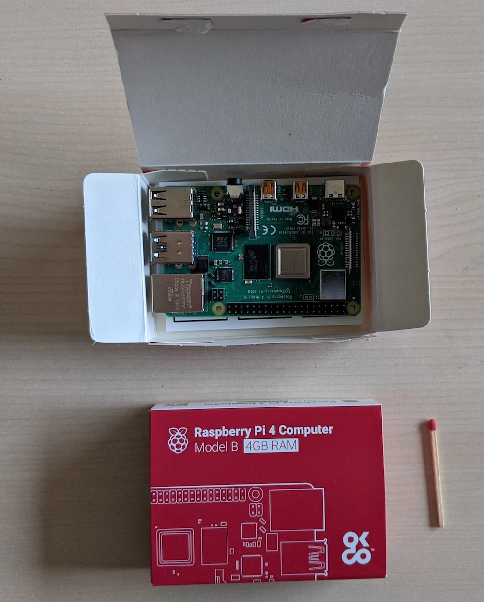
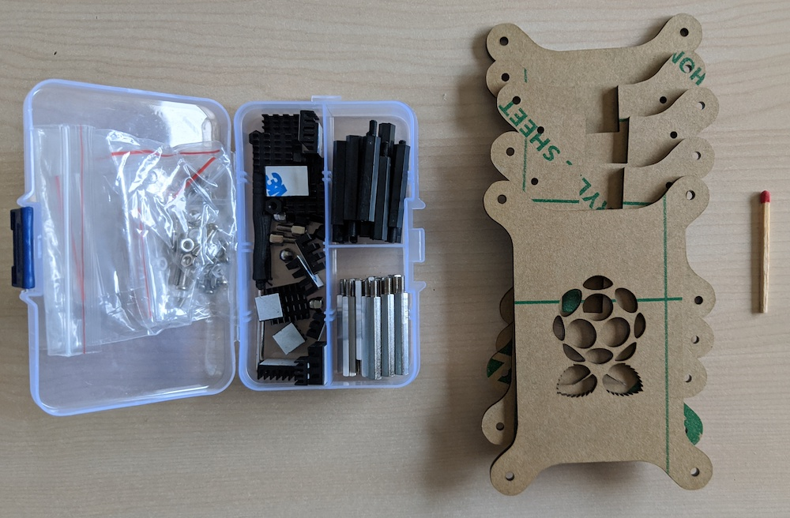
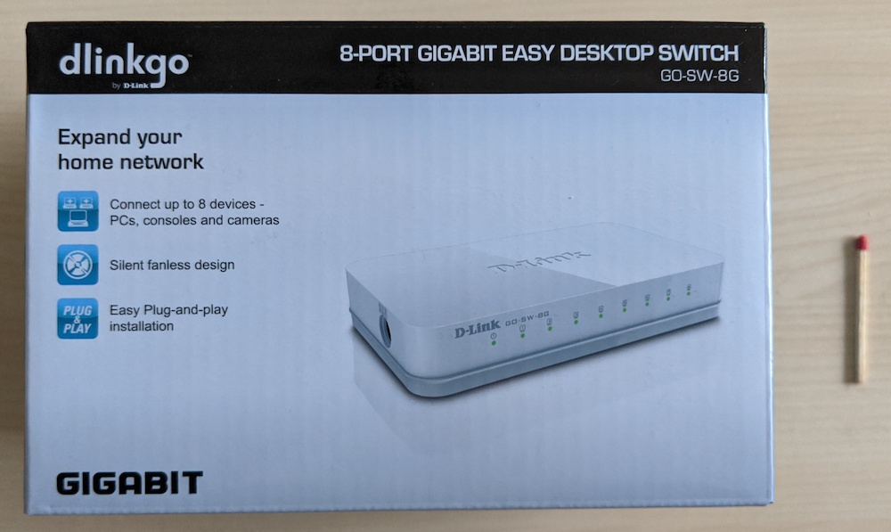
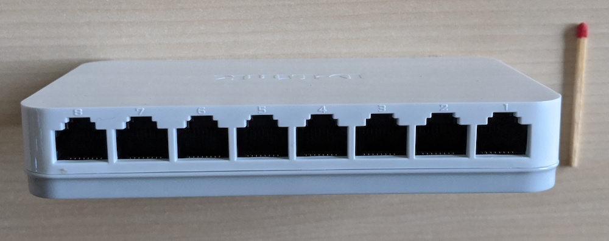
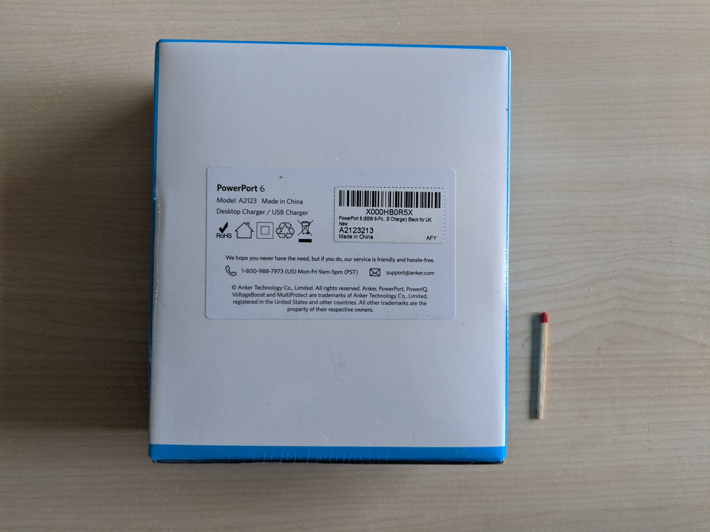
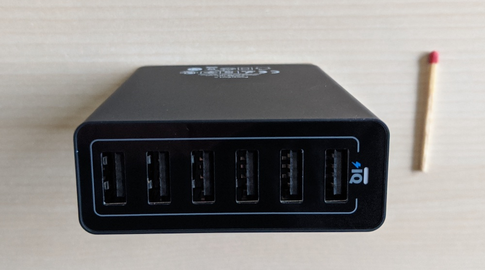
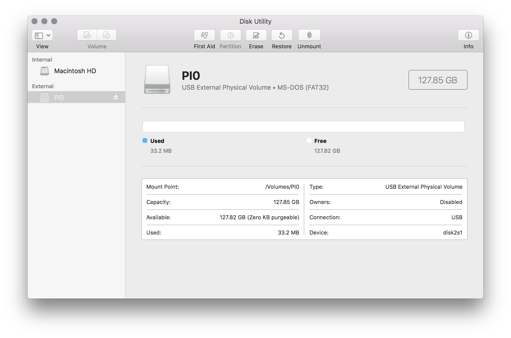
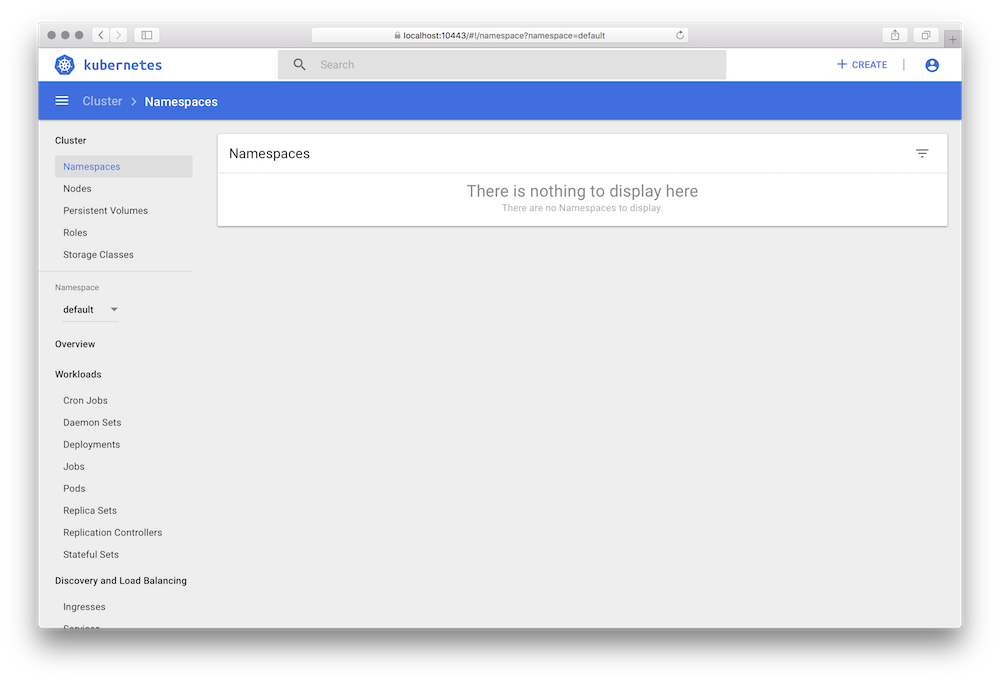

# Kubernetes on Raspberry Pi 4b with 64-bit OS from scratch

[Hardware](#hardware)
  1. [Bill of materials](#bill-of-materials)
  1. [Final setup](#final-setup)

[Software](#software)
  1. [Preparing the SD cards](#1-preparing-the-sd-cards)
  1. [Install the Operating System on the SD cards](#2-install-the-operating-system-on-the-sd-cards)
  1. [Initial setup of the Operating System](#3-initial-setup-of-the-operating-system)
  1. [Configure SSH](#4-configure-ssh)
  1. [Install Kubernetes](#5-install-kubernetes)
  1. [Install Helm](#6-install-helm)
   
[References](#references)

---

## Hardware

### Bill of materials

Three [Raspberry Pi 4 Model B](https://www.amazon.co.uk/gp/product/B07TC2BK1X/) 4GB, ARM-Cortex-A72 4x 1.50GHz (from now on RPI):


A rack for the RPIs, [Jun_Electronic Gray Stackable Case](https://www.amazon.co.uk/gp/product/B07F6Y1MJ6/):



[SanDisk Ultra 128 GB microSDXC](https://www.amazon.co.uk/gp/product/B073JYC4XM/) memory card:


[D-Link GO-SW-8G 8-Port Gigabit switch](https://www.amazon.co.uk/gp/product/B008PC1MSO/) to hard-wire the RPIs via Ethernet cables:



[Anker PowerPort 60 W 6-Port](https://www.amazon.co.uk/gp/product/B00PK1IIJY/) 
as the power supply:



[TP-Link TL-MR3020 V3 wireless router](https://www.amazon.co.uk/gp/product/B078GXZJHP/r):
TBD.

Also, you'll need the following items:

- 3x [USB C to USB A cables](https://www.amazon.co.uk/gp/product/B07W12JK3J/) for powering the RPIs.
- 3x [cat6 Ethernet cables](https://www.amazon.co.uk/gp/product/B01J8KFTB2/) for connecting the RPIs to the switch.
- 1x HDMI-on-micro-HDMI cable to connect a screen to an RPI.
- 1x USB keyboard.

Then follow steps to [assemble](https://projects.raspberrypi.org/en/projects/raspberry-pi-setting-up/4) RPIs.

### Final setup

TBD: show final setup and connections.

## Software

In the following we walk through how to set up the RPI operating system (OS) and Kubernetes. Note that I'm using macOS as the host operating system, that is, where I prepare the SD cards and install the RPI OS (steps 1. and 2. below), so you may end up using different tools if you're carrying out these steps in a different environment, say Linux or Windows.

### 1. Preparing the SD cards

Open up the disk utility app and erase/format the SD cards using the `MS-DOS (FAT)` format:



### 2. Install the Operating System on the SD cards

Download a 64bit Linux OS. For example, grab [Ubuntu 19.10](http://cdimage.ubuntu.com/releases/19.10/release/),
that is, download the file `ubuntu-19.10.1-preinstalled-server-arm64+raspi3.img.xz` and extract the image like so:

```sh
$ xz -d ubuntu-19.10.1-preinstalled-server-arm64+raspi3.img.xz
```

Now, flash the SD card (install the OS, make it bootable) using the following sequence:

```sh
# have a look what is mounted:
$ diskutil list
...
/dev/disk2 (external, physical):
   #:                       TYPE NAME                    SIZE       IDENTIFIER
   0:     FDisk_partition_scheme                        *127.9 GB   disk2
   1:                 DOS_FAT_32 PI0                     127.8 GB   disk2s1

# unmount the SD card:
$ diskutil unmountdisk /dev/disk2
Unmount of all volumes on disk2 was successful

# now, flash the SD card with the OS:
$ sudo dd if=ubuntu-19.10.1-preinstalled-server-arm64+raspi3.img of=/dev/disk2 bs=2m
1485+1 records in
1485+1 records out
3115115520 bytes transferred in 126.646778 secs (24596879 bytes/sec)

# flush cache (pending disk writes):
$ sync /dev/disk2

# eject SD card so you can insert into the Pi:
$ diskutil eject /dev/disk2
Disk /dev/disk2 ejected
```

### 3. Initial setup of the Operating System

As per [instructions](https://ubuntu.com/download/raspberry-pi), log in 
with `ubuntu` and `ubuntu`. The system tells you to change the password at first login.

For now, a cable connection is assumed. This makes the following setup easy and fast.

First, upgrade the OS:

```sh
sudo apt update
sudo apt upgrade
```

Next, we set up the network in a way that the three RPIs are using statically assigned
IP addresses `192.168.1.42` to `192.168.1.44` when connected via the switch (Ethernet cables)
and get assigned dynamic IP addresses via DHCP, in addition to that, for the wireless
networking. We will use the static IPs for the Kubernetes setup.

For this to work, remove all files from `/etc/netplan/` and create a new file called [my-net-config.yaml](software/my-net-config.yaml) with the following info (note: here shown for the future control plane node with IP `192.168.1.42`, that value has to be changed for each RPI): 

```yaml
network:
  version: 2
  ethernets:
    eth0:
      dhcp4: false
      addresses: [192.168.1.42/24]
      gateway4: 192.168.1.254
      nameservers:
        addresses: [8.8.8.8, 4.4.4.4]
  wifis:
    wlan0:
      dhcp4: true
      access-points:
        "MY-NETWORK-SSID":
          password: "MY-NETWORK-PASSWORD"
```

Note: the value for `gateway4` is your router or default gateway and for your convenience you can get the template via `curl -L https://301.sh/rpi-net`.

To apply the changes, run `sudo netplan --debug try`, then `sudo netplan --debug generate`,
`sudo netplan --debug apply`, and `reboot` for good measures. Once the RPI comes
back up again, you can check the network configuration with `ip addr`.

Finally, for Ubuntu, we need to manually enable [memory cgroups](https://www.kernel.org/doc/Documentation/cgroup-v1/memory.txt).
To achieve this, execute the following command:

```sh
sudo sed -i '$ s/$/ cgroup_enable=memory cgroup_memory=1/' /boot/firmware/nobtcmd.txt
```

And, last but not least, do a `sudo reboot` for the RPI, to apply the changes.

Now we have the basic OS-level config in place, let's make it a little more secure.

### 4. Configure SSH

At this point in time, you should be able to SSH into your RPIs like so:

```sh
$ ssh ubuntu@192.168.1.42
The authenticity of host 192.168.1.42 can't be established.
ECDSA key fingerprint is SHA256:sozuirlqXh88YtbXxLDYL/DCCBzf2oSFGxOItwjs1so.
Are you sure you want to continue connecting (yes/no)? yes
Warning: Permanently added '192.168.1.42' (ECDSA) to the list of known hosts.
ubuntu@192.168.1.42's password:
...
```

As you can see from above, this requires a password. Let's do an SSH-key-based-only login.

For this, we first create an SSH key pair for each RPI and distribute the public keys:

```sh
# set target RPI name, for example "kube-rpi-cp" or "kube-rpi-node0":
RPI_SSH_KEY_TARGET=kube-rpi-node0

# generate SSH key pair on host machine:
ssh-keygen -b 2048 -t rsa -f $RPI_SSH_KEY_TARGET -q -N ""

# copy over public key to RPI:
ssh-copy-id -i $RPI_SSH_KEY_TARGET.pub ubuntu@$RPI_SSH_KEY_TARGET

# move RPI key pair to our local key repo:
mv $RPI_SSH_KEY_TARGET* ~/.ssh/
```

Now, following the [official instructions](https://help.ubuntu.com/community/SSH/OpenSSH/Configuring)
we set `PasswordAuthentication no` in `/etc/ssh/sshd_config`, apply using `sudo systemctl restart ssh`
and from then on, only the SSH-key-based login is possible.

### 5. Install Kubernetes

Create a new cluster by provisioning the control plane:

```sh
$ ssh ubuntu@kube-rpi-cp

ubuntu@kube-rpi-cp:~$ curl -sfL https://get.k3s.io | sh -
[INFO]  Finding latest release
[INFO]  Using v1.0.1 as release
[INFO]  Downloading hash https://github.com/rancher/k3s/releases/download/v1.0.1/sha256sum-arm64.txt
...
[INFO]  systemd: Enabling k3s unit
Created symlink /etc/systemd/system/multi-user.target.wants/k3s.service → /etc/systemd/system/k3s.service.
[INFO]  systemd: Starting k3s
```

Note: if you want you can now have a look at how the API server is doing by using
the `sudo journalctl -u k3s -f` command.

Now check if all is well, you should see something like the following:

```sh
ubuntu@kube-rpi-cp:~$ kubectl version
Client Version: version.Info{Major:"1", Minor:"16", GitVersion:"v1.16.3-k3s.2", GitCommit:"e7e6a3c4e9a7d80b87793612730d10a863a25980", GitTreeState:"clean", BuildDate:"2019-11-18T18:31:23Z", GoVersion:"go1.13.4", Compiler:"gc", Platform:"linux/arm64"}
Server Version: version.Info{Major:"1", Minor:"16", GitVersion:"v1.16.3-k3s.2", GitCommit:"e7e6a3c4e9a7d80b87793612730d10a863a25980", GitTreeState:"clean", BuildDate:"2019-11-18T18:31:23Z", GoVersion:"go1.13.4", Compiler:"gc", Platform:"linux/arm64"}

ubuntu@kube-rpi-cp:~$ kubectl get no -o wide
NAME          STATUS   ROLES    AGE     VERSION         INTERNAL-IP    EXTERNAL-IP   OS-IMAGE       KERNEL-VERSION      CONTAINER-RUNTIME
kube-rpi-cp   Ready    master   3m10s   v1.16.3-k3s.2   192.168.1.42   <none>        Ubuntu 19.10   5.3.0-1014-raspi2   containerd://1.3.0-k3s.5
```

Now we can join worker nodes to the cluster. Note that the value for `k3s_token` comes
from the control plane node, get it via `sudo cat /var/lib/rancher/k3s/server/node-token`. 

To join a worker node, do:

```sh
$ ssh ubuntu@kube-rpi-node0

ubuntu@kube-rpi-node0:~$ k3s_server="https://192.168.1.42:6443"
ubuntu@kube-rpi-node0:~$ k3s_token=XXX

ubuntu@kube-rpi-node0:~$ curl -sfL https://get.k3s.io | K3S_URL=$k3s_server K3S_TOKEN=$k3s_token sh -
```

Time to check on the control plane node (note: this command is issued from the host system, in my case the macOS-based one):

```sh
$ ssh ubuntu@kube-rpi-cp kubectl get no -o wide
NAME             STATUS   ROLES    AGE     VERSION         INTERNAL-IP    EXTERNAL-IP   OS-IMAGE       KERNEL-VERSION      CONTAINER-RUNTIME
kube-rpi-node0   Ready    <none>   3m48s   v1.16.3-k3s.2   192.168.1.43   <none>        Ubuntu 19.10   5.3.0-1014-raspi2   containerd://1.3.0-k3s.5
kube-rpi-cp      Ready    master   17m     v1.16.3-k3s.2   192.168.1.42   <none>        Ubuntu 19.10   5.3.0-1014-raspi2   containerd://1.3.0-k3s.5
```

Now that we have Kubernetes up and running, we can move on to the app-level.

BTW, don't worry about rebooting the RPIs. I ususally use `sudo shutdown now` on each of them to cleanly exit, worker nodes first, control plane last.

### 6. Install Helm

First we need to [get Helm and install it](https://helm.sh/docs/intro/install/):

```sh
# define what Helm version and where to install:
export HELM_VERSION=v3.0.2
export HELM_INSTALL_DIR=/usr/local/bin

# download the binary and get into place:
wget https://get.helm.sh/helm-$HELM_VERSION-linux-arm64.tar.gz
tar xvzf helm-$HELM_VERSION-linux-arm64.tar.gz
sudo mv linux-arm64/helm $HELM_INSTALL_DIR/helm

# clean up:
rm -rf linux-arm64 && rm helm-$HELM_VERSION-linux-arm64.tar.gz
```

Next, let's add some repositories:

```sh
# add the official stable charts repo:
helm repo add stable https://kubernetes-charts.storage.googleapis.com/

# add another repo:
helm repo add bitnami https://charts.bitnami.com/bitnami
```

Now we can install apps, for example, the Kube dashboard:

```sh
# this is necessary to address https://github.com/rancher/k3s/issues/1126 for now:
export KUBECONFIG=/etc/rancher/k3s/k3s.yaml

# make sure that we install the dashboard in the kube-system namespace:
sudo kubectl config set-context --current --namespace=kube-system

# install the dashboard, note how we explicitly ask for the Arm version:
ubuntu@kube-rpi-cp:~$ helm install kdash stable/kubernetes-dashboard \
                           --set=image.repository=k8s.gcr.io/kubernetes-dashboard-arm64

# wait until you see the pod in 'Running' state:
ubuntu@kube-rpi-cp:~$ watch kubectl get pods -l "app=kubernetes-dashboard,release=kdash"
```

Next, we want to make sure we can access the RPI Kubernetes cluster from the
host machine, so that we can forward traffic and access the dashboard directly
in our usual environment.

To achieve this, do the following:

1. Copy the content of `/etc/rancher/k3s/k3s.yaml` and paste it into a file on your host machine, for example, `kube-rpi-config.yaml`
1. Change the line `server: https://127.0.0.1:6443` to `server: https://kube-rpi-cp:6443` (or `server: https://192.168.1.42:6443` if you haven't updated your `/etc/hosts` file ;)
1. Now you can access the cluster like so: `kubectl --kubeconfig=./kube-rpi-config.yaml get nodes`

We can set up port forwarding and access the Kube dashboard of our RPI cluster
on our host machine (remember to execute this on your machine, not one of the RPIs):

```sh
$ kubectl --kubeconfig=./kube-rpi-config.yaml port-forward \
          --namespace kube-system \
          svc/kdash-kubernetes-dashboard 10443:443
Forwarding from 127.0.0.1:10443 -> 8443
Forwarding from [::1]:10443 -> 8443
Handling connection for 10443
...
```

Before we can access the dashboard, get the token from the control plane RPI like so: 

```sh
ubuntu@kube-rpi-cp:~$ kubectl get secret \
                      $(kubectl get sa kdash-kubernetes-dashboard -o jsonpath="{.secrets[0].name}") \
                      -o jsonpath="{.data.token}" | \
                      base64
Blah1234...
```

Now you access the dashboard via [https://localhost:10443](https://localhost:10443/)
and using the token retrieved from the previous step:



That's it for now.

## References

### Articles

In the process of preparing this walkthrough, I've perused the following articles:

- [Kubernetes On 64 Bit OS Raspberry Pi 4](http://sirchia.cloud/2019/12/kubernetes-on-64-bit-os-raspberry-pi-4/), 12/2019, by Robert Sirchia
- [Kubernetes Homelab with Raspberry Pi and k3sup](https://blog.alexellis.io/raspberry-pi-homelab-with-k3sup/), 10/2019, by Alex Ellis
- [How I made a Kubernetes cluster with five Raspberry Pis](https://www.zenko.io/blog/how-i-made-a-kubernetes-cluster-with-a-couple-of-raspberry-pis/), 05/2019, by Salim Salaues
- [Building a hybrid x86–64 and ARM Kubernetes Cluster](https://medium.com/@carlosedp/building-a-hybrid-x86-64-and-arm-kubernetes-cluster-e7f94ff6e51d), 01/2019, by Carlos Eduardo

### Docs

The following docs are useful:

- RPI docs: [Setting up your Raspberry Pi](https://projects.raspberrypi.org/en/projects/raspberry-pi-setting-up)
- Ubuntu docs: [SSH](https://help.ubuntu.com/community/SSH/)
- K3s docs: [Installation](https://rancher.com/docs/k3s/latest/en/installation/)
- [k3sup.dev](https://github.com/alexellis/k3sup)